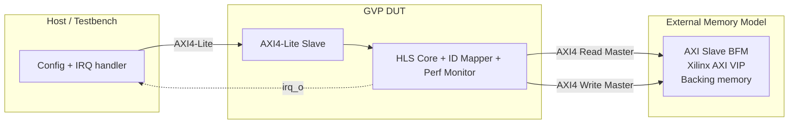
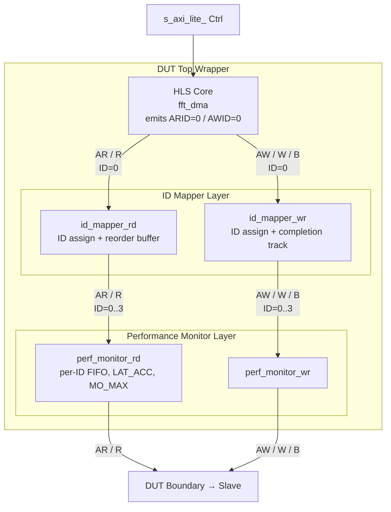
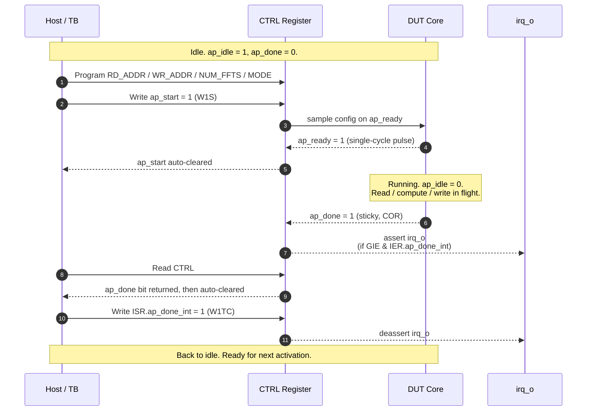
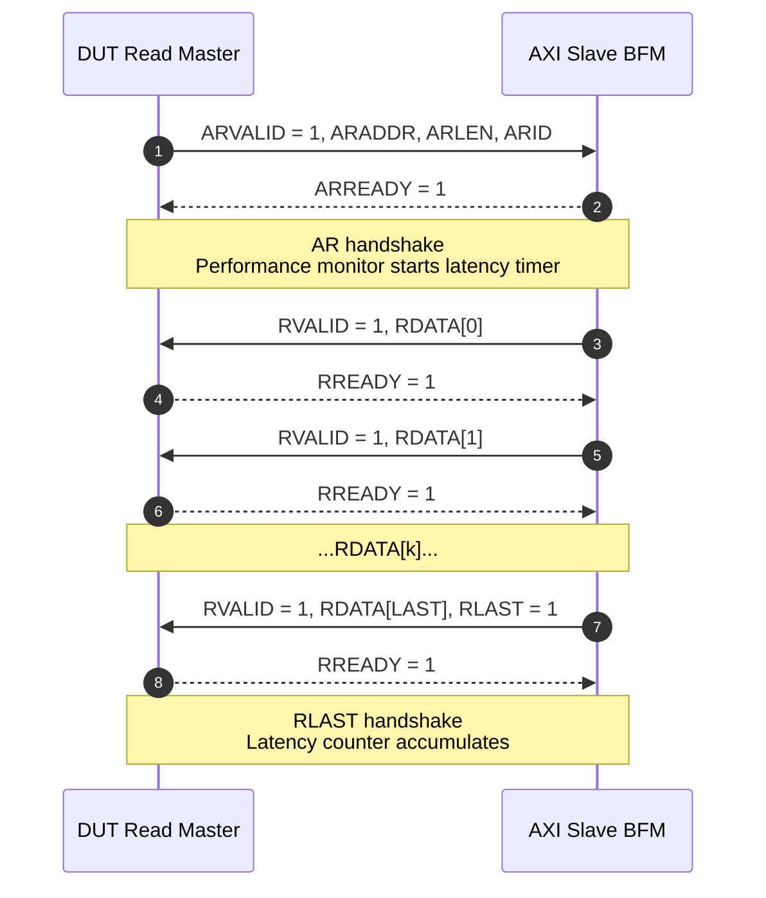
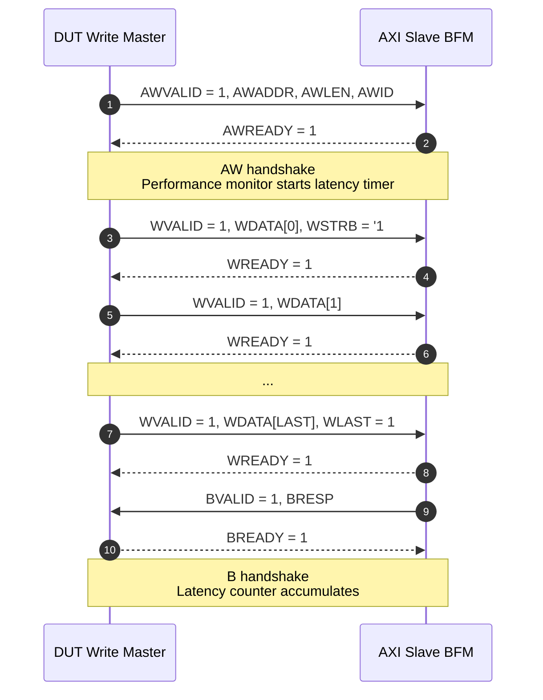
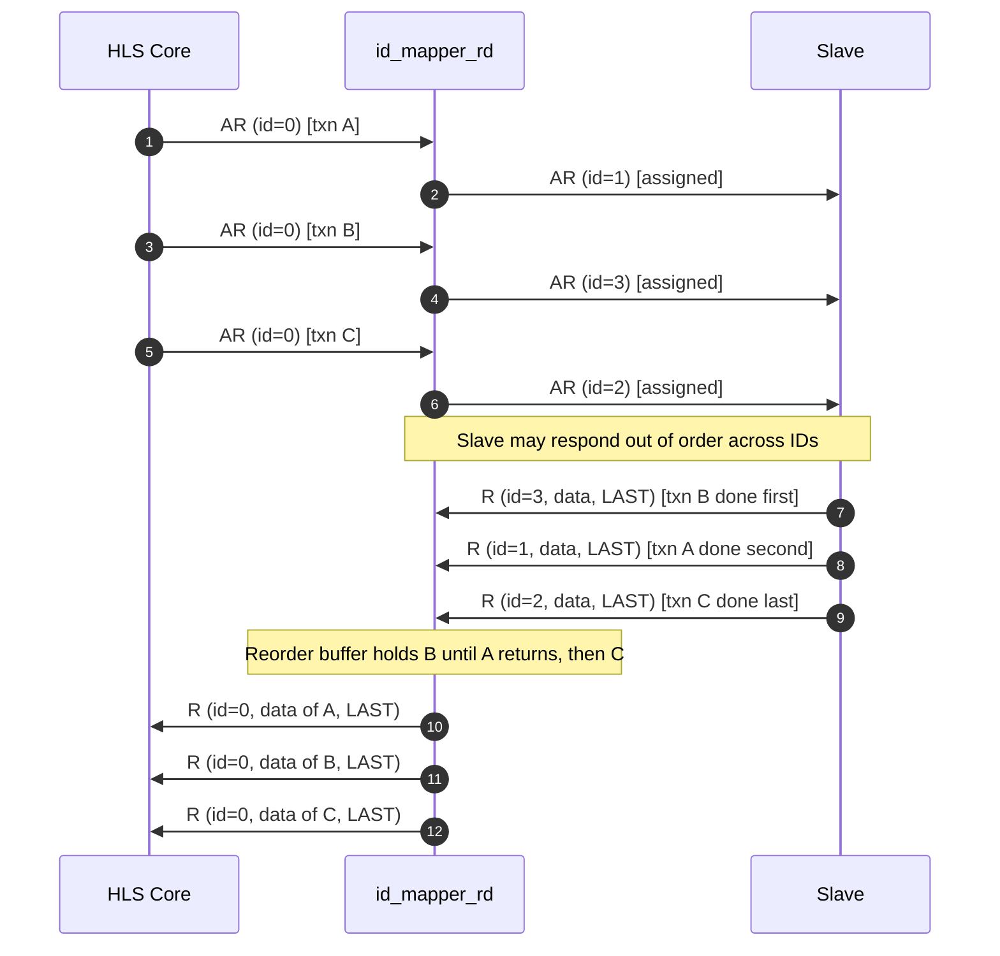
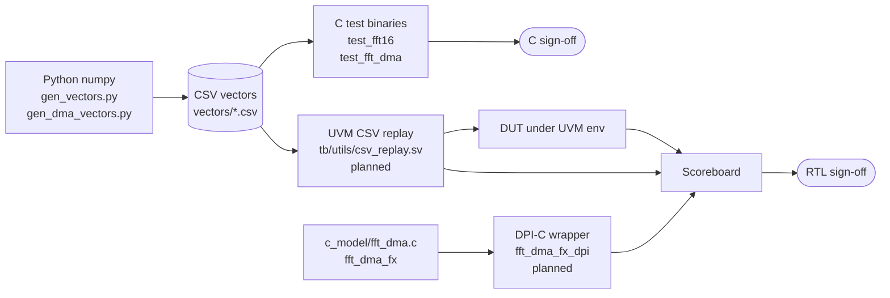

# GVP Diagrams

Visual references for the GVP DUT and its verification environment.
Diagrams are rendered by GitHub automatically via Mermaid. If a diagram
here disagrees with `GVP_RTL_SPEC.md`, the spec wins.

---

## 1. Top-Level System

The DUT sits between a control host (the testbench, in verification;
a CPU / MicroBlaze in a real system) and an external memory model.



Legend:
- Solid arrows are AXI traffic.
- Dashed arrow is the level-sensitive interrupt.

---

## 2. DUT Internal Hierarchy

The DUT top wrapper hosts an HLS-generated core plus two thin
hand-written layers: ID mappers (per master) and performance monitors
(at the DUT boundary, outside the mappers).



The performance monitors are pass-through observers: signals cross
them unchanged. They only compute counters that feed the `PERF_CNT`
register block through `CTRL` (not shown for clarity).

---

## 3. Activation Timeline (`ap_ctrl_hs`)

One end-to-end activation from the host's point of view.



- Reading `CTRL` clears `ap_done` but does not clear `ISR` bits.
- `ISR` requires explicit W1TC so an ISR can acknowledge without
  racing a `CTRL` read.

---

## 4. AXI Read Transaction (Single Burst)

A minimal read transaction from the DUT's read master.



For MO > 1 the master can issue several AR handshakes before the
first R response arrives. The slave may interleave R responses of
different IDs (out-of-order); the DUT's ID mapper wrapper
reassembles them.

---

## 5. AXI Write Transaction (Single Burst)



W beats can start immediately after AW (or even before, per AXI4).
The B response cannot precede the corresponding WLAST.

---

## 6. ID Mapper — Read-Side Reorder

Illustrates the RANDOM policy: three consecutive AR requests from
the HLS core get different IDs; the slave replies out of order; the
mapper reorders them before returning to the HLS core.



The HLS core sees only ID 0 responses in exactly the order it made
the requests. The AXI channel between the mapper and the slave
exercises the full ID range and out-of-order behavior.

---

## 7. Sample / Beat Layout

How Q2.14 complex samples pack into a 256-bit AXI beat and how
one 16-point FFT lays out across two beats.

```text
                                    32-bit sample slot
                                    ┌─────────┬─────────┐
                                    │ imag    │ real    │
                                    │ Q2.14   │ Q2.14   │
                                    │ [31:16] │ [15:0]  │
                                    └─────────┴─────────┘

Beat 0 (32 bytes = 256 bits), samples 0..7 packed LSB→MSB:
[255:224] [223:192] [191:160] [159:128] [127:96] [95:64] [63:32] [31:0]
 sample 7  sample 6  sample 5  sample 4  sample 3 sample 2 sample 1 sample 0

Beat 1 (32 bytes), samples 8..15 packed LSB→MSB:
[255:224] [223:192] [191:160] [159:128] [127:96] [95:64] [63:32] [31:0]
 sample15  sample14  sample13  sample12  sample11 sample10 sample 9 sample 8

One 16-point FFT = 2 beats = 64 bytes.
FFT k occupies bytes [base + k*64, base + (k+1)*64).
```

Little-endian throughout. Rules are enforced by
`c_model/fft_dma.c` (`read_sample` / `write_sample`) and mirrored in
the HLS `INTERFACE` pragmas.

---

## 8. Verification Data Flow

How the same CSV vectors flow through C sign-off, DPI-based
scoreboard, and CSV replay for the future UVM environment.



Key property: the same Python golden used to sign off the C model
is reused (via the same CSV files and via DPI to the same C
function) to sign off the DUT. No parallel golden path exists — a
divergence would show up as a scoreboard mismatch on identical
vectors.

---

## Related Documents

- `docs/GVP_RTL_SPEC.md` — Authoritative behavior spec.
- `docs/GVP_VPLAN.md` — Test list and coverage plan.
- `README.md` — Project overview with the top-level ASCII block
  diagram.
