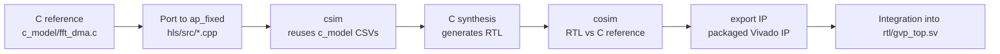

# GVP HLS Guide

Working notes for using Vitis HLS with the GVP project. Covers the
environment quirks on this machine, the intended project layout, and
the flow from C reference → HLS synthesis → RTL export. Written
before the first HLS source lands so it can be followed as work
begins.

## 1. Environment

### 1.1 Installation Layout

Xilinx 2025.2 is installed at `/opt/Xilinx/2025.2/`.

| Path                                            | Contents                        |
|-------------------------------------------------|----------------------------------|
| `/opt/Xilinx/2025.2/Vitis/`                     | Vitis (including HLS)            |
| `/opt/Xilinx/2025.2/Vivado/`                    | Vivado, xsim                     |

The `vitis_hls` binary is at
`/opt/Xilinx/2025.2/Vitis/bin/unwrapped/lnx64.o/vitis_hls`. The
top-level `Vitis/bin/vitis_hls` wrapper script is missing from this
install — the vendor packaging shipped only the unwrapped binary at
this location.

### 1.2 The Vendor `settings64.sh` Problem

Xilinx tools normally require sourcing a shell script that exports
`XILINX_VITIS`, `XILINX_VIVADO`, `PATH`, `LD_LIBRARY_PATH`, and
several other variables:

```bash
source /opt/Xilinx/2025.2/Vitis/settings64.sh
```

Inspecting the file shows it delegates to
`/home/ubuntu/Xilinx/2025.2/Vitis/.settings64-Vitis_for_HLS.sh` —
a leftover from the installer user (`ubuntu`) that never got
rewritten to the actual install location. As a result the vendor
script fails immediately.

Two workarounds:

**A. Repo-local env script (no sudo needed)** — Preferred for the
day-to-day flow.

```bash
cd ~/GVP
source scripts/xilinx_env.sh
```

Sets `XILINX_VITIS`, `XILINX_HLS`, `XILINX_VIVADO`, `RDI_DATADIR`,
`PATH`, `LD_LIBRARY_PATH`, and prints where each tool resolved.
Sufficient for `vivado`, `xsim`, and for `vitis_hls` invocation via
its absolute path.

**B. One-shot symlink so the vendor scripts work** — Requires sudo,
does the fix system-wide.

```bash
sudo mkdir -p /home/ubuntu
sudo ln -s /opt/Xilinx /home/ubuntu/Xilinx

# From then on the vendor script works:
source /opt/Xilinx/2025.2/Vitis/settings64.sh
```

Either workaround is sufficient. Option B gives a proper
`vitis_hls` wrapper in `PATH`; option A does not (see `XILINX_HLS_BIN`
env var it exports for the direct invocation).

### 1.3 Quick Sanity Check

After sourcing either environment:

```bash
vivado -version           # should print 2025.2
xsim -version             # should print version info
```

For Vitis HLS specifically, until option B is applied:

```bash
"$XILINX_HLS_BIN" -version
```

## 2. Planned Project Layout

```
hls/
├── src/                  # HLS synthesizable C++ (top + primitives)
│   ├── fft_dma_top.cpp   # Top function with AXI-Lite slave + AXI masters
│   ├── fft_dma_top.hpp
│   ├── fft16_hls.hpp     # ap_fixed<> ports of the C reference
│   └── ...
├── tb/                   # HLS csim testbench
│   └── fft_dma_tb.cpp    # Reuses c_model CSVs; drives fft_dma_top
├── configs/              # TCL fragments for build variants
│   ├── mo4.tcl
│   ├── mo8.tcl
│   ├── mo16.tcl
│   └── mo32.tcl
├── scripts/              # Project driver scripts (invoked by Makefile)
│   ├── create_project.tcl
│   ├── run_csim.tcl
│   ├── run_synth.tcl
│   ├── run_cosim.tcl
│   └── run_export.tcl
└── build/                # Generated projects (git-ignored)
    ├── mo4/
    ├── mo8/
    └── ...
```

The `hls/build/` subtree is a generator output and is covered by the
existing `.gitignore` rule for `hls/build*/`.

## 3. Flow Overview



Each step is invoked from a Makefile target that calls a TCL script;
no interactive GUI required.

## 4. Porting the C Reference

The existing `c_model/fft_dma.c` uses plain `int16_t` for Q2.14
samples. Porting to HLS is mostly a mechanical translation:

- Replace `int16_t` sample fields with `ap_fixed<16, 2>` (or
  `ap_int<16>` if a raw view is preferred).
- Replace the raw byte-addressed `memory_t` with `ap_uint<256>*`
  parameters marked `m_axi`.
- Add `s_axilite` interface pragmas for every scalar control input
  (`src_addr`, `dst_addr`, `num_ffts`, `mode`) and for `return`
  (the `ap_ctrl_hs` handshake).
- Add `m_axi` interface pragmas for the two data ports, one bundle
  per master (`gmem_rd`, `gmem_wr`) with `num_read_outstanding`,
  `num_write_outstanding`, and burst-length caps parameterized by
  the current build config.

The FFT kernel itself (`fft16_forward_fx`) can be reused almost
verbatim; only its types change.

## 5. csim — Reusing the CSV Vectors

`hls/tb/fft_dma_tb.cpp` should:

1. Load `c_model/vectors/fft_dma_vectors.csv` (curated) or
   `fft_dma_random_*.csv` (regression) with the same parser logic as
   `c_model/test_fft_dma.c`.
2. Allocate a byte buffer as the mock external memory.
3. For each scenario:
   - Write inputs (converted to Q2.14 raw) into the buffer.
   - Invoke `fft_dma_top` with the same `src_addr`, `dst_addr`,
     `num_ffts`, and `mode`.
   - Compare the buffer's dst region against the CSV expected values
     with the same tolerance rules as `test_fft_dma`.

Because the C reference and the HLS source share the same kernel,
csim should be bit-exact against the CSVs.

## 6. Synthesis and Configuration Sweeps

Each `configs/moN.tcl` sets:

- `#pragma HLS INTERFACE m_axi` values for `num_read_outstanding`,
  `num_write_outstanding`, `max_read_burst_length`,
  `max_write_burst_length`.
- A build tag (e.g., `-DGVP_BUILD_TAG="mo16"`) that the SV
  `build_info_pkg` (planned) can read at TB elaboration time to
  drive configuration coverage (VPLAN Section 4.3).

Typical invocation:

```bash
make -C hls synth CONFIG=mo16
```

Each build produces a project under `hls/build/mo16/`.

## 7. cosim — Bit-Exact RTL vs Reference

After synthesis, `run_cosim.tcl` launches xsim under HLS control
against a subset of the CSV scenarios (`fft_dma_vectors.csv`).
Cosim is orders of magnitude slower than csim, so only the curated
set is used at this stage.

## 8. Export IP

`run_export.tcl` calls `export_design -format ip_catalog`. The
resulting IP packages under `hls/build/<config>/solution1/impl/ip/`
and is what the UVM testbench and future SoC integration consume.

## 9. Troubleshooting

**"vitis_hls: command not found" after sourcing xilinx_env.sh**
- The wrapper script is missing at `Vitis/bin/vitis_hls`. Invoke
  via `$XILINX_HLS_BIN` (already exported by `xilinx_env.sh`), or
  apply the sudo-symlink workaround (Section 1.2 option B).

**"libxv_hls_support.so: cannot open shared object file"**
- `LD_LIBRARY_PATH` was not set. Confirm `scripts/xilinx_env.sh`
  was sourced in the current shell (not just executed).

**"RDI_DATADIR environment variable is not set"**
- `RDI_DATADIR` is exported by `xilinx_env.sh`. If missing, source
  the script again.

**"Can't find a usable init.tcl"**
- The vendor loader normally arranges the tcl paths through
  `Vitis/bin/setupEnv.sh`. If `vitis_hls` runs on the unwrapped
  binary directly, this can fail. Applying the sudo-symlink
  workaround and using the wrapped `vitis_hls` avoids this.

## Reference

- `scripts/xilinx_env.sh` — repo-local env setup.
- `docs/GVP_RTL_SPEC.md` — spec the HLS source must implement.
- `c_model/fft_dma.c` — reference to port from.
- `docs/GVP_VPLAN.md` Section 4.3 — configuration coverage the HLS
  build sweeps must feed.
